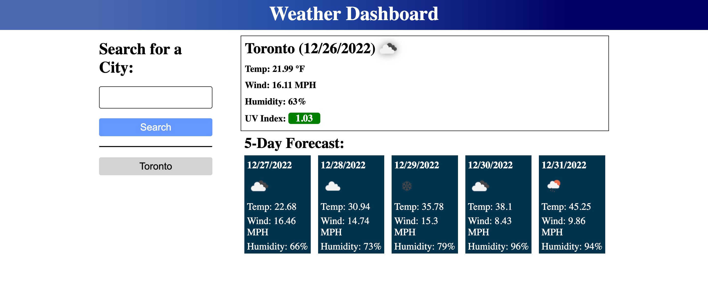

## Server-Side APIs Challenge: Weather Dashboar

1. [ Description. ](#desc)
2. [ Web Address. ](#web-address)
3. [ Usage tips. ](#usage)
4. [ Contributing. ](#contributing)
5. [ License. ](#license)

<a name="desc"></a>
## 1. Description

### This application is a Weather Dashboard, created using Open Weather API, Javascript, Boostrap and CSS.

This application is to catch your current and five day forecast in one view. It also saves your cities searched for later use.

Desktop screen 
( "")


<a name="web-address"></a>
## 2. How to Get There

### Open your favorite web browser and enter the following web address to access.

```html
https://es api-weather-dashboard/
```
<a name="usage"></a>
## 3. Usage Tips

### Testing the application

#### Enter a city and click the magnifying glass to get your forecast results.

"one-city-searched")

### Add more cities by searching for other cities
### Click on any city saved to search for that city again

"one-city-searched-2")

### Refresh the page to validate local storage saving.

"refresh-clicked")

<a name="contributing"></a>
## 4. Contributing
Pull requests are welcome. For major changes, please let repository owner know to discuss what would you like to change.

<a name="license"></a>
## 5. License
None
